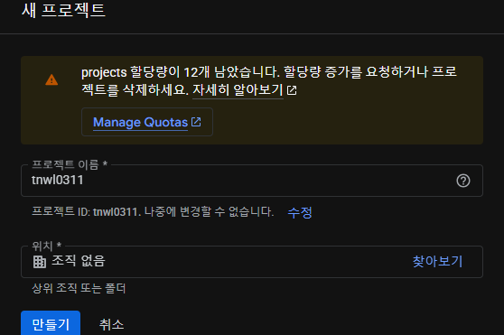

# OAuth2란?
-OAuthd는 제3자에게 계정 관리를 맡기는 방식. 흔히 네이버 / 카카오 / 구글 로그인 같은 방식

용어 정리.
-Resource Owner : 인증 서버에 자신의 정보를 사용하도록 허가하는 주체
-Resource Server : 리소스 오너의 정보를 가지며 리소스 오너의 정보를 보호하는 주체 / 여기서는 구글 / 네이버 / 카카오.
-Client Application : 인증 서버에게 인증을 받고 리소스 오너의 리소스를 사용하는 주체.
여기서는 우리가 만들고 있는 서비스.

OAuth를 사용하면 인증 서버에서 발급받은 _토큰_ 을 사용해서 리소스 서버에 리소스 오너의 정보를 요청하고 응답받아 사용할 수 있음.
그러면 Client는 어떻게 리소스 오너의 정보를 취득하는게 가능한가?

## Resource Owner의 정보를 취득하는 방법
1. 권한 부여 승인 타입(Authorization code grant type) : OAuth2에서 가장 보편적인 인증 방안.
클라이언트가 리소스에 접근하는 데 사용, 권한에 접근할 수 있는 코드와 리소스 오너에 대한 엑세스 토큰을 발급받는 방식.
2. 암시적 승인 타입(Implicit grant type) : 서버가 없는 JS 웹 애플리케이션 클라이언트에서 주로 사용하는 방법. 클라이언트가 요청을 보내면 리소스 오너의 인증 과정 외에는 권한 코드 교환 등 별다른 인증 과정을 거치지 않고 바로 액세스 토큰을 제공 받음.
3. 리소스 소유자 암호 자격증명 방식(Resource Owner password credentials) : 클라이어트의 패스워드를 이용해서 액세스 토큰에 대한 사용자의 자격 증명을 교환하는 방식
4. 클라이언트 자격증명 승인 타입(Client credentials grant) : 클라이언트가 컨텍스트 외부에서 액세스 토큰을 얻어 특정 리소스에 접근을 허용할 때 사용하는 방식

권한 부여 코드 승인 타입 중심으로 설명할 때는, 사용자 데이터가 외부로 전송되지 않아 안전하고, OAuth에서 가장 잘 알려진 방식이라고 함.

-권한 요청 : 클라이언트(여기서는 SpringBoot server)가 특정 사용자 데이터에 접근하기 위해 권한 서버, 즉 카카오 및 구글 권한 서버에 요청을 보내는 것을 의미. 요청 URL은 권한 서버마다 다르지만 보통은 클라이언트 ID / Redirect URI / 응답 타입 등을 파라미터로 보냄.
- 권한 요청을 위한 파라미터 예시
```
GET spring-authorization-server.example/authorize?
client_id=YOUR_GOOGLE_TOKEN
redirect_uri=http://localhost:5173/
response_type=code&
scope=profile
```
client_id : 인증 서버가 클라이언트에 해당한 고유 식별자.
redirect_uri : 로그인 성공 시 이동하는 URI 주소
response_type : 클라이언트가 제공받길 원하는 응답 타입. 인증 코드를 받을 때는 code값을 포함해야 함.
scope : 제공받고자 하는 리소스 오너의 정보 목록

액세스 토큰을 받게 되는데 이를 API 응답 / return
그래서 액세스 토큰을 통해서 리소스 오너의 정보를 가져오게 되면, 리소스 서버는 토큰이 유효한지 검사한 뒤에 응답합니다.

그래서 우리는 Google 로그인 추가를 위해서 인증 서버에서 토큰을 제공받아야 합니다.

https://cloud.google.com/cloud-console


-API 및 서비스 -> 사용자 인증 정보

```java
spring.application.name=shoppinglist2

spring.datasource.url=jdbc:mariadb://localhost:3310/shoppinglist2db
spring.datasource.username=root
spring.datasource.password=1234
spring.datasource.driver-class-name=org.mariadb.jdbc.Driver

spring.jpa.generate-ddl=true
spring.jpa.hibernate.ddl-auto=create-drop
spring.jpa.show-sql=true

spring.data.rest.basePath=/api

springdoc.swagger-ui.enabled=true
springdoc.swagger-ui.path=/swagger-ui.html
springdoc.api-docs.path=/api-docs
//Google OAuth2 클라이언트 설정
spring.security.oauth2.client.registration.google.client-id=YOUR_GOOGLE_CLIENT_ID
spring.security.oauth2.client.registration.google.client-secret=YOUR_SECRET_KEY
spring.security.oauth2.client.registration.google.scope=openid, profile, email
// OAuth2 성공 후 redirect될 프론트엔드 URL
// 추후 이용
oauth2.success.redirect-url=http://localhost:5173/login/oauth2/redirect
```

# 이제 프론트엔드 수정
back-front 연결할건데 Fetch API 쓸거 아니라서 axios 설치할겁니다.
npm install axios

프론트엔드 상에서 Google OAuth2 관련 라이브러리를 직접 사용하여 로그인 흐름을 처리할 수 있음.
프론트엔드가 직접 로그인 팝업을 띄우고 결과를 처리할 수 있도록 하는 라이브러리임
`@react-oauth/google`

이상의 라이브러리를 사용하면, Google 로그인 버튼 컴포넌트를 쉽게 추가 가능하고, 로그인 성공 시 Google로부터 받은 사용자 정보(혹은 ID 토큰)를 처리할 수 있음.

-이상의 방식을 도입하더라도 백엔드와의 인증 연동이 필요함.
프론트엔드에서 Google 로그인이 성공하면, Google이 발급한 토큰을 백엔드로 보내서 검증하고, 백엔드는 검증된 사용자에 대해 JWT 토큰을 발급하여 프론트엔드에게 줘야합니다.(이부분을 우리가 아까 작성했습니다)
프론트엔드는 이 최종 JWT를 이용하여 백엔드 API를 호출하게 됩니다(이 과정에서 axios가 사용되겠네요)

npm install @react-oauth/google

